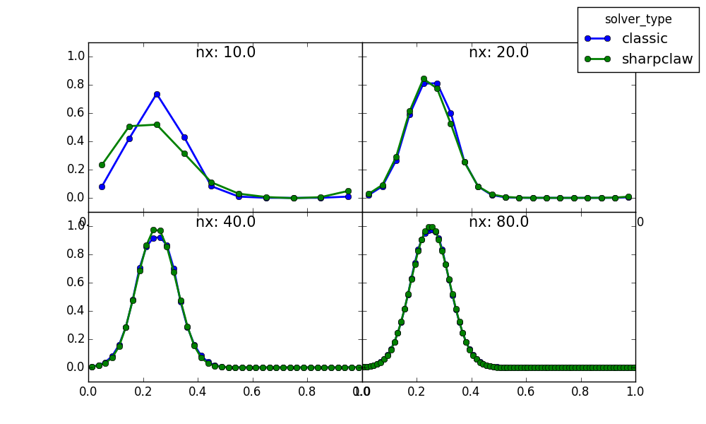

# Polo: exploratory plotting from Pandas dataframes

Polo is a small collection of routines for comparing records from
Pandas dataframes.  The data in each record might be a single numerical value
or a collection of 3D fields from a large simulation.  Currently
it's only known to work with PyClaw Solution objects.

## Example: Comparing PyClaw simulations
To give an example of what one might want to do, I will consider the following
scenario (which is actually carried out in the `polo_demo.ipynb` notebook in this
repository):

Using PyClaw, we can run a sequence of 1D advection problems with
  - Different algorithms
  - Different CFL numbers
  - Different grid sizes

So we have the following parameters to our data set: q, space, time, limiter, CFL, mesh width.

In Polo, we can fix some of the dimensions and compare across others.
Comparisons can assign different values to:
  - Different lines on the same axes
  - Different axes on the same figure
  - Different figures
  - A sequence (animation, iplot)
  - A widget selector
  - The x-axis or y-axis of the plot

For instance, we might assign time as sequence, grid sizes to different axes,
and algorithms to different lines for a fixed mesh width.  Space would be the
x-axis and q would be the y-axis.  Here is an example of how one frame of that looks:

In the notebook, there is also a slider for time.

## Usage
The main function is:

    polo.comparison_plot(df,fig,facets)

See the docstring or the example notebook for an explanation of the arguments.

## Dependencies
The following are recommended:
- IPython version 4.2.0 or greater
- Matplotlib version 1.5.1 or greater
- ipywidgets version 5.1.3 or greater
